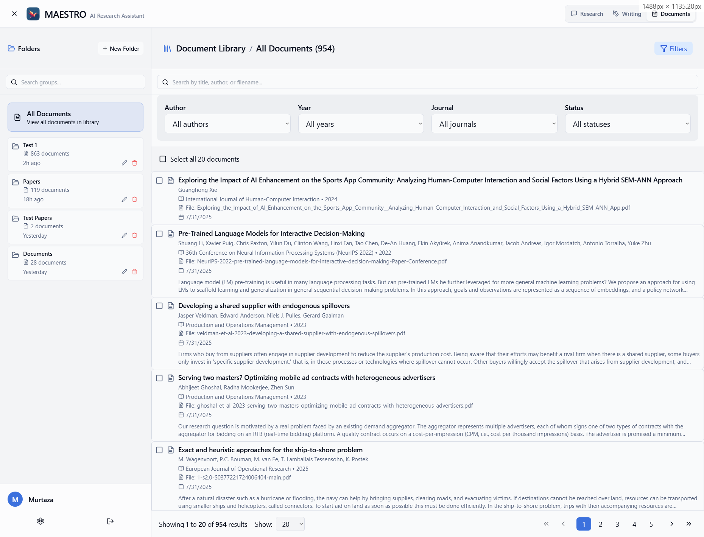
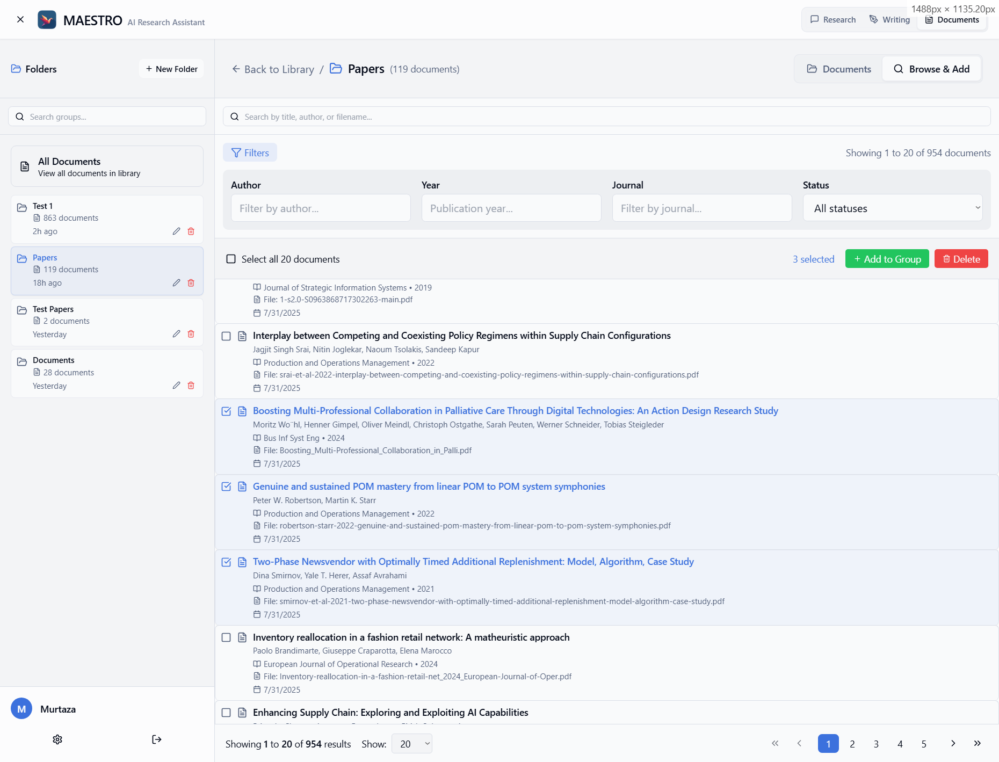
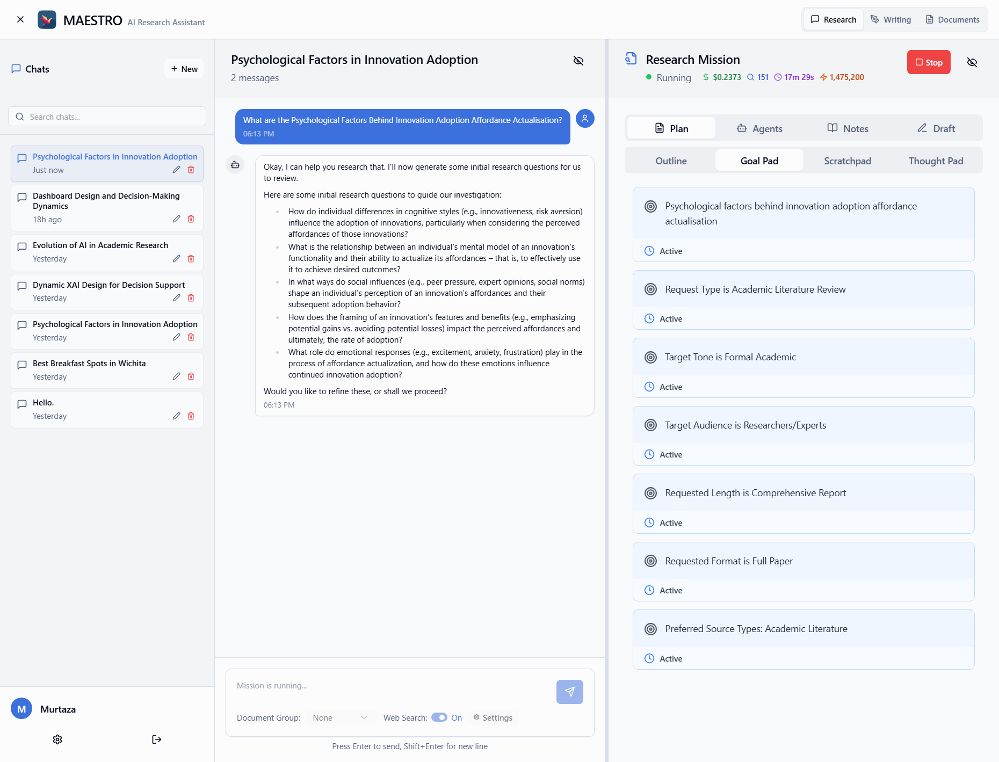
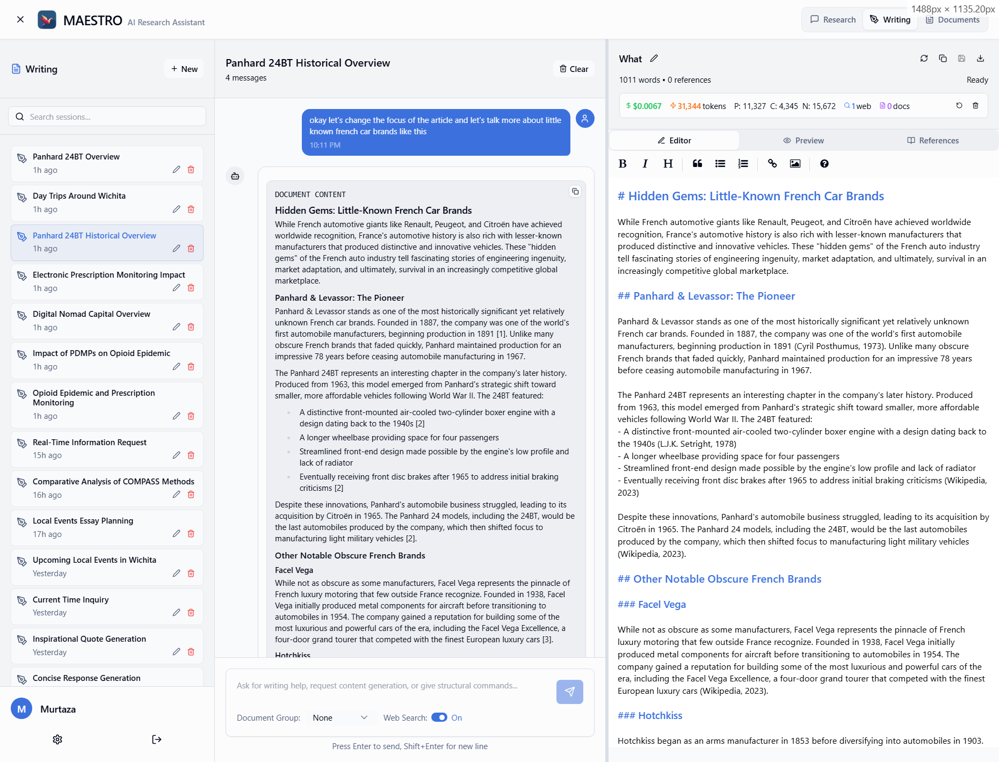
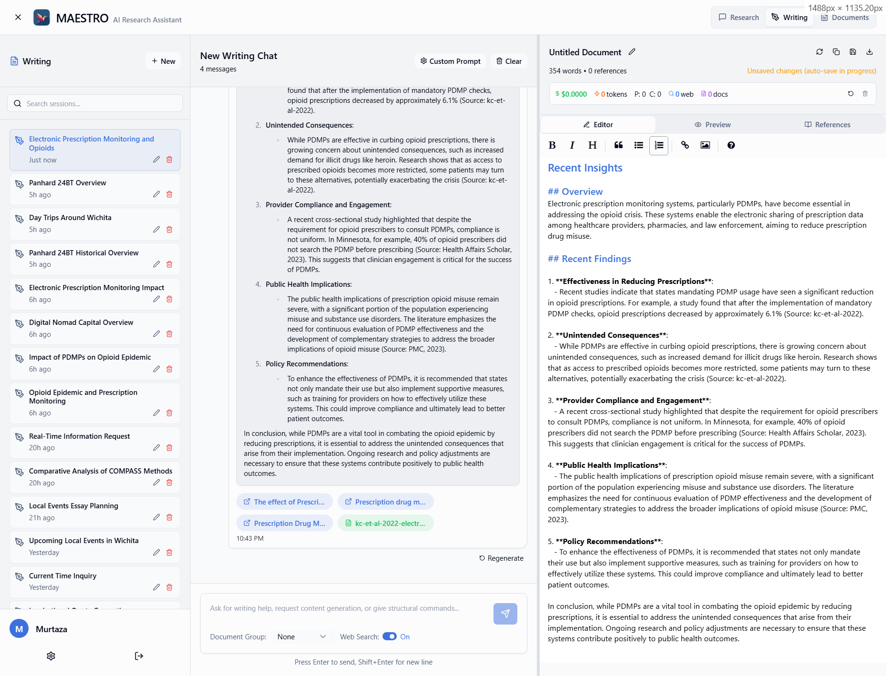
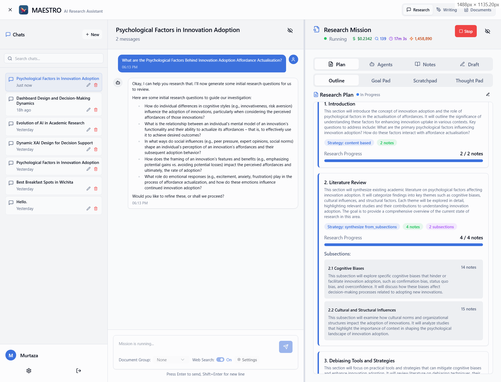
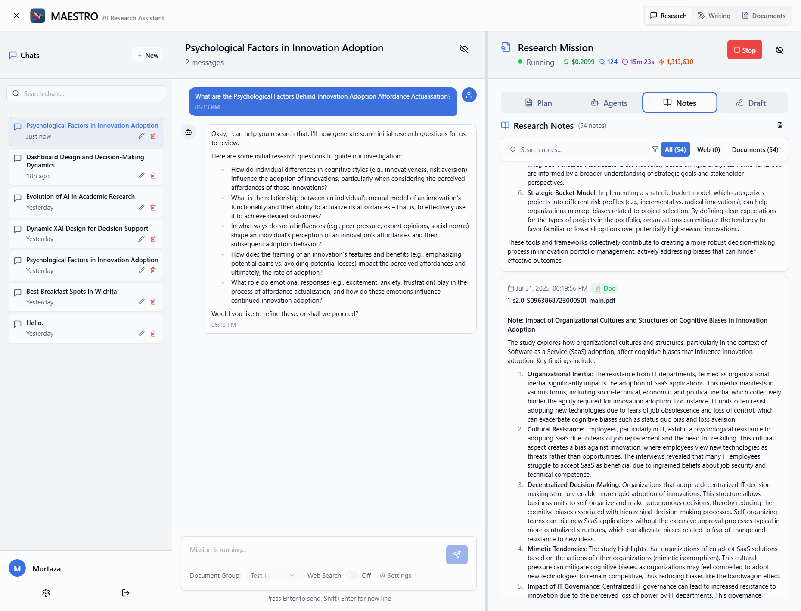
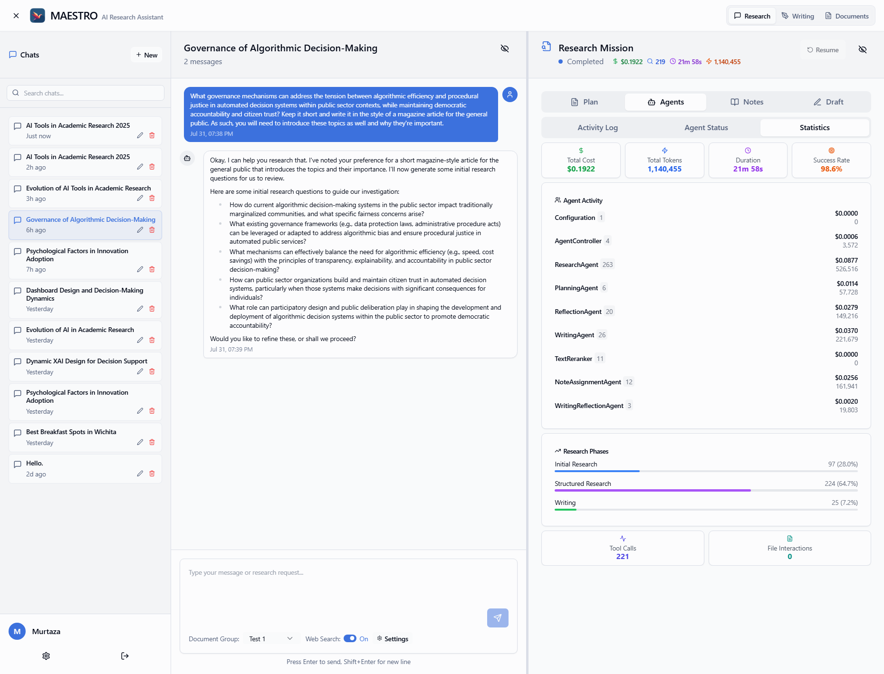
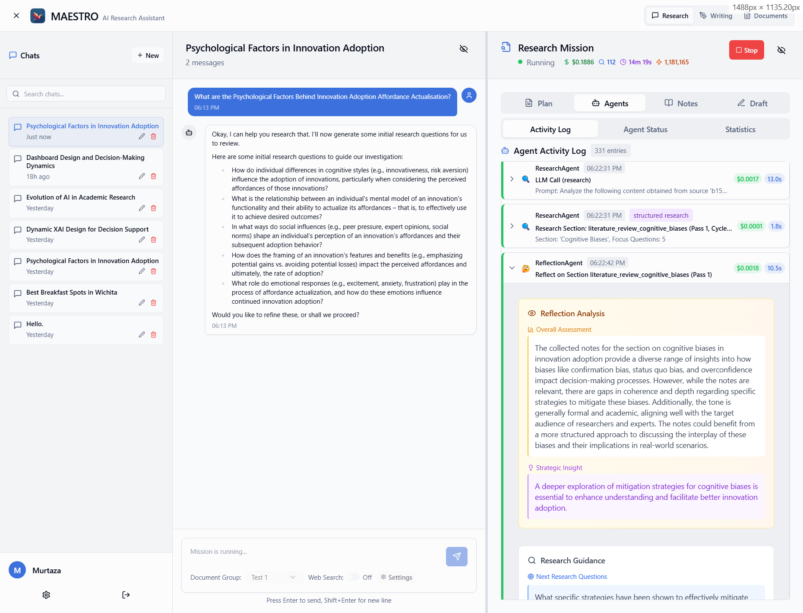

<p align="center">
  
</p>

# AXIOM: Your Self-Hosted AI Research Assistant

[](https://www.gnu.org/licenses/agpl-3.0)
[](https://github.com/murtaza-nasir/axiom.git)
[](https://hub.docker.com/r/murtaza-nasir/axiom)
[](https://murtaza-nasir.github.io/axiom/)

> **Latest Development (April 2026) - Major post-fork enhancements**
>
> Since forking from Maestro, AXIOM has added 200+ commits including:
> - **GPU Worker Subprocess** *(new, production since April 2026)*: Shared embedder/reranker/GLiNER run in an isolated subprocess communicating with backend and doc-processor over msgpack-over-Unix-socket RPC. Clean CUDA context release on idle, zero backend downtime during unload, single worker shared across containers. See [Architecture](docs/architecture/gpu-worker.md).
> - **OpenAI-Compatible API**: `/api/v1/chat/completions` endpoint with API key management for programmatic document Q&A
> - **Per-Model Device Config**: Fine-grained GPU/CPU assignment per model (`DEVICE_EMBEDDER`, `DEVICE_RERANKER`, `DEVICE_GLINER`, `DEVICE_MREBEL`, `DEVICE_MARKER`, `DEVICE_VISION`) for tight VRAM budgets
> - **GLiNER + mREBEL**: Zero-shot multilingual entity and relation extraction replacing spaCy
> - **Knowledge Graph Retrieval**: Entity-based chunk expansion across documents with query-level entity extraction
> - **PDF Page Numbers**: 3-tier page label extraction (publisher metadata → header/footer parsing → physical) for accurate academic citations
> - **New AI Providers**: Native DeepSeek and Z.AI (Zhipu GLM) support with special handling
> - **Citation System**: Configurable citation profiles (Numbered, APA 6/7, custom) with per-mission overrides
> - **RAG Enhancements**: OpenSearch BM25, hybrid retrieval with RRF fusion, cuBLAS workspace cleanup
> - **Search Providers**: SearXNG with configurable engines, YaCy support, Brave API integration
> - **Apple Silicon**: MPS GPU support for native macOS deployment
> - **Robustness**: 3-level JSON fallback, context window truncation, multilingual support
> - **Deployment**: Podman Quadlet (production on Proxmox LXC 120), pre-built Docker images on nimbus, macOS hybrid dev stack

## Roadmap

Upcoming improvements planned:

- **[OpenDataLoader PDF Integration](docs/plans/opendataloader-integration.md)** — CPU-based PDF parser alternative to Marker, frees ~2.5GB VRAM during imports and provides best-in-class table extraction (0.928 accuracy)
- **Streaming API**: Server-Sent Events for the OpenAI-compatible endpoint
- **Frontend Question Refinement**: Complete the UI flow for research question refinement (currently stub functions in the frontend)

AXIOM is an AI-powered research platform you can host on your own hardware. It's designed to manage complex research tasks from start to finish in a collaborative research environment. Plan your research, let AI agents carry it out, and watch as they generate detailed reports based on your documents and sources from the web.

## Documentation

**[View Full Documentation](https://murtaza-nasir.github.io/axiom/)**

- **[Quick Start](https://murtaza-nasir.github.io/axiom/getting-started/quickstart/)** - Get up and running in minutes
- **[Installation](https://murtaza-nasir.github.io/axiom/getting-started/installation/)** - Platform-specific setup
- **[Configuration](https://murtaza-nasir.github.io/axiom/getting-started/configuration/overview/)** - AI providers and settings
- **[User Guide](https://murtaza-nasir.github.io/axiom/user-guide/)** - Complete feature guide
- **[Example Reports](https://murtaza-nasir.github.io/axiom/example-reports/)** - Sample outputs from various models
- **[Troubleshooting](https://murtaza-nasir.github.io/axiom/troubleshooting/)** - Common issues and solutions

## Screenshots

<p align="center">
  
</p>

<details>
  <summary><strong>Document Library</strong></summary>
  <br>
  <p align="center">
    
  </p>
</details>

<details>
  <summary><strong>Document Groups</strong></summary>
  <br>
  <p align="center">
    
  </p>
</details>

<details>
  <summary><strong>Mission Settings</strong></summary>
  <br>
  <p align="center">
    
  </p>
</details>

<details>
  <summary><strong>Chat Interface</strong></summary>
  <br>
  <p align="center">
    
  </p>
</details>

<details>
  <summary><strong>Writing Assistant</strong></summary>
  <br>
  <p align="center">
    
  </p>
</details>

<details>
  <summary><strong>Research Transparency</strong></summary>
  <br>
  <p align="center">
    
  </p>
</details>

<details>
  <summary><strong>AI-Generated Notes</strong></summary>
  <br>
  <p align="center">
    
  </p>
</details>

<details>
  <summary><strong>Mission Tracking</strong></summary>
  <br>
  <p align="center">
    
  </p>
</details>

<details>
  <summary><strong>Agent Reflection</strong></summary>
  <br>
  <p align="center">
    
  </p>
</details>

## Getting Started

### Prerequisites
- Docker and Docker Compose (v2.0+)
- 16GB RAM minimum (32GB recommended)
- 30GB free disk space
- API keys for at least one AI provider

### Quick Start

```bash
# Clone and setup
git clone https://github.com/murtaza-nasir/axiom.git
cd axiom
./setup-env.sh    # Linux/macOS
# or
.\setup-env.ps1   # Windows PowerShell

# Start services
docker compose up -d

# Monitor startup (takes 5-10 minutes first time)
docker compose logs -f axiom-backend
```

Access at **http://localhost** • Default: `admin` / `pass found in .env`

For detailed installation instructions, see the [Installation Guide](https://murtaza-nasir.github.io/axiom/getting-started/installation/).

## Configuration

- **CPU Mode**: Use `docker compose -f docker-compose.cpu.yml up -d`
- **GPU Support**: Automatic detection on Linux/Windows with NVIDIA GPUs
- **Network Access**: Configure via setup script options

For troubleshooting and advanced configuration, see the [documentation](https://murtaza-nasir.github.io/axiom/).

## Recent Releases

### Version 0.1.10-alpha (October 12, 2025)
**Azure OpenAI & Configuration Improvements**
- Azure OpenAI support including GPT-5 models with automatic parameter handling
- Manual model entry toggle for providers without `/models` endpoint support
- Fixed 401 errors from external providers no longer logging users out
- Mission settings now persist correctly across server restarts
- Disabled autocomplete on API key fields to prevent browser autofill issues

### Version 0.1.9-alpha (October 3, 2025)
**Stability & Security Update**
- Fixed mission pause/resume with proper checkpoint handling
- Replaced passlib with maintained libpass fork
- Resolved Round/Pass counter and activity log persistence issues
- Fixed bcrypt compatibility for authentication

### Version 0.1.8-alpha (September 26, 2025)
**Mission Resilience & Document Intelligence Update**
- Intelligent mission resume with complete checkpoint preservation
- arXiv paper fetcher for direct academic paper processing
- Writing phase resume support
- Document reprocessing and re-embedding capabilities
- Fixed progress indicators for accurate research tracking

## Core Features

- **Multi-Agent Research System**: Planning, Research, Reflection, and Writing agents working in concert
- **Advanced RAG Pipeline**: Dual BGE-M3 embeddings with PostgreSQL + pgvector, Knowledge Graph entity extraction, OpenSearch BM25 hybrid retrieval
- **5 Native AI Providers**: OpenAI, DeepSeek, Z.AI (Zhipu GLM), OpenRouter, and any OpenAI-compatible endpoint
- **Citation Profiles**: Numbered, APA 6 (German/KMU), APA 7 (English), and custom citation styles with per-mission overrides
- **Document Management**: PDF, Word, and Markdown support with semantic search and image extraction
- **Web Integration**: Multiple search providers (Tavily, LinkUp, Jina, SearXNG)
- **Hardware Flexibility**: CUDA, ROCm, MPS (Apple Silicon), and CPU — auto-detected or configurable
- **Self-Hosted**: Complete control over your data and infrastructure
- **Local LLM Support**: OpenAI-compatible API for running your own models (vLLM, SGLang)

## License

This project is **dual-licensed**:

1.  **GNU Affero General Public License v3.0 (AGPLv3)**: AXIOM is offered under the AGPLv3 as its open-source license.
2.  **Commercial License**: For users or organizations who cannot comply with the AGPLv3, a separate commercial license is available. Please contact the maintainers for more details.

## Contributing

Feedback, bug reports, and feature suggestions are highly valuable. Please feel free to open an Issue on the GitHub repository.
