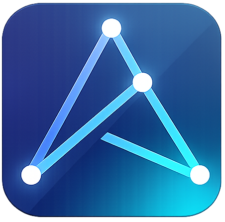

<p align="center">
  
</p>

<p align="center"><strong>axiom</strong> — a research knowledge engine for your
Zotero library.</p>

axiom turns the research documents you already manage in Zotero into a
searchable, citable knowledge base. It speaks to Zotero's API, processes your
library, and exposes a query API for your research clients — retrieve the right
passage in the right book, and cite it with a locator that points at the exact
page.

## Table of contents

- [How to get it up](#how-to-get-it-up)
- [Documentation](#documentation)
- [Big picture](#big-picture)
- [Contributing](#contributing)
- [License](#license)

## How to get it up

A minimal local setup is two processes on loopback plus two stores:

```text
axiom dispatcher  ──HTTP contract──▶  axiom runner
owns state, queue, search index        does conversion, chunking, ML
```

1. **Run the axiom runner** (no GPU needed for a first test):
   ```bash
   python3 -m venv .venv
   .venv/bin/pip install -r axiom_ng_runner/requirements.txt
   export AXIOM_PROCESSOR_COMPUTE=reference
   export AXIOM_PROCESSOR_ALLOWED_SOURCE_ROOTS=<path-to-zotero-storage>  # the `storage` folder of your Zotero data dir
   .venv/bin/python -m axiom_ng_runner   # listens on :8537
   ```
2. **Run the axiom dispatcher**:
   ```bash
   export AXIOM_ZOTERO_BASE=http://localhost:23119/api
   export AXIOM_DATABASE_URL=postgres://<user>:<pass>@localhost:5432/<db>
   export AXIOM_OPENSEARCH_URL=http://localhost:9200
   export AXIOM_PROCESSOR_URL=http://127.0.0.1:8537
   export AXIOM_DISPATCHER_ENABLED=true
   cd axiom_ng && go run ./cmd/axiom-ng   # API on :8011
   ```
3. **Sync Zotero, then watch the pipeline**:
   ```bash
   curl -X POST http://127.0.0.1:8011/api/zotero/sync
   curl     http://127.0.0.1:8011/api/ingest/jobs
   ```

Requirements: Zotero desktop (Local API enabled), PostgreSQL with `pgvector`,
and OpenSearch. A GPU is optional — everything runs on CPU/Apple MPS for a
first test.

## Documentation

- **[Full Documentation](https://cyb3rdudu.github.io/axiom/)** — Welcome,
  Concept Tour, User Guide, Developer Guide, Operations, References.
- **[Quick Start](https://cyb3rdudu.github.io/axiom/get-started/quickstart/)** —
  get up and running in minutes, with every env var.
- **[Installation / Deployment](https://cyb3rdudu.github.io/axiom/operations/deployment/)** —
  platform-specific setup, including the split-role multi-runner setup (a local
  retrieval runner plus a remote GPU processing runner).
- **[Configuration](https://cyb3rdudu.github.io/axiom/developer-guide/configuration/)** —
  every `AXIOM_*` variable in one table.
- **[User Guide](https://cyb3rdudu.github.io/axiom/user-guide/ingest/)** —
  sync, ingest, retrieval.
- **[Troubleshooting](https://cyb3rdudu.github.io/axiom/operations/troubleshooting/)** —
  common issues and their fixes.

## Big picture

axiom is a **research RAG**: retrieve the right passage in the right book, and
cite it with a locator that points at the exact page.

- **Zotero is your document and source management.** axiom talks to Zotero
  through its API, mirrors what it needs, and processes the documents — Zotero
  stays the source of truth, and axiom never replaces it.
- **A query API for your research clients.** Ask questions that land on the
  exact book, section, and page — semantic, cross-lingual search with exact
  source locations.
- **A modular runner model.** Compute happens in discrete runners that can be
  placed where it makes sense: ranking and retrieval on a local runner for low
  latency, chunking and full processing on a strong remote GPU runner.

### What a researcher can do

- Turn a Zotero library into a searchable knowledge base without reorganizing
  it — axiom works with your existing collections, tags, and items.
- Ask a research question and get the right passages from the right books,
  across languages, with page/line locators for every result.
- Cite with confidence: every result carries its source locator, so you can
  open the original and verify rather than trust a snippet.

## Contributing

The documentation site (MkDocs Material) and the docs in this repository are
the guided entry points for contributing. See the
[Developer Guide](https://cyb3rdudu.github.io/axiom/developer-guide/architecture/)
for the architecture, contracts, configuration, and testing — and the docs
those chapters link to. Reports of issues and pull requests are welcome.

## License

[Apache License 2.0](https://github.com/Cyb3rDudu/axiom/blob/main/LICENSE)
