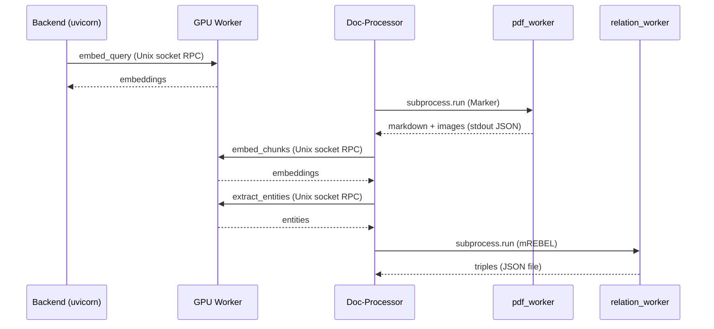

# GPU Worker Subprocess Architecture

All GPU model inference (embedding, reranking, entity extraction) runs inside a single shared subprocess that communicates with the main backend over a Unix domain socket.

## Why a Subprocess?

PyTorch allocates a CUDA context the first time any GPU operation runs. That context holds memory mappings, kernel caches, and device state that **cannot be fully released** without terminating the process. Calling `torch.cuda.empty_cache()` frees cached allocations, but the context itself (roughly 300-700 MB depending on the driver) remains resident until process exit.

This creates two problems for a long-lived backend:

1. **VRAM leak on idle** -- after a burst of queries the backend holds GPU memory indefinitely, even when no models are loaded.
2. **No clean handoff** -- when the document processor needs VRAM for Marker or mREBEL, there is no way to reclaim the backend's CUDA context.

The subprocess pattern solves both: kill the subprocess, and the OS reclaims every byte of VRAM. The main backend process (uvicorn) stays alive and keeps serving API requests, WebSockets, and database queries with zero downtime.

## Architecture Overview

```
axiom-backend container (uvicorn, always running)
├── GPU worker subprocess (BGE-M3, BGE-reranker, GLiNER)
│     Listens on Unix socket, dies on idle, respawns on demand
│     One process serves both containers
│
axiom-doc-processor container (long-lived coordinator)
├── pdf_worker subprocess (Marker, per-import, exits after use)
├── relation_worker subprocess (mREBEL, per-import, exits after use)
└── connects to backend's GPU worker via shared socket (client_mode)
```

### Component Roles

| Component | Lifecycle | Models | Socket Role |
|---|---|---|---|
| **GPU worker** | Spawned on first GPU call, killed on idle | BGE-M3 embedder, BGE-reranker-v2-m3, GLiNER | Server (binds socket) |
| **Backend** | Always running | None (uses facades) | Owner (spawns worker) |
| **Doc-processor** | Always running | None (uses facades + subprocesses) | Client (connects to worker) |
| **pdf_worker** | Per-import, exits after | Marker | None (standalone) |
| **relation_worker** | Per-import, exits after | mREBEL | None (standalone) |

### How Calls Flow



## The RPC Protocol

The GPU worker uses a length-prefixed msgpack protocol over a Unix domain socket. Each message is framed as:

```
[4 bytes: payload length, big-endian][msgpack payload]
```

**Request format:**

```python
{"method": "embed_query", "args": {"text": "..."}, "id": "abc123"}
```

**Response format (success):**

```python
{"id": "abc123", "ok": True, "result": [...]}
```

**Response format (error):**

```python
{"id": "abc123", "ok": False, "error": "...", "traceback": "..."}
```

numpy arrays are serialized natively via `msgpack-numpy`. Each RPC call opens a fresh socket connection (stateless), and the server handles concurrent connections with a thread pool (default 4 threads).

### Available RPC Methods

| Method | Arguments | Returns | Used By |
|---|---|---|---|
| `health` | (none) | `{pid, uptime_sec, loaded, vram_mb}` | Status checks, idle monitor |
| `embed_query` | `text` | Dense + sparse embedding dict | Retriever, chat |
| `embed_chunks` | `chunks` (list of dicts) | Chunks with embeddings attached | Document processor |
| `rerank` | `query`, `items`, `top_n` | `[[score, original_index], ...]` | Retriever |
| `extract_entities` | `text`, `labels`, `threshold`, `multi_label` | List of entity dicts | Entity extractor, graph retrieval |
| `shutdown` | (none) | `{ok: true}` | Graceful teardown |

## Facade Layer

Call sites throughout the codebase (retriever, entity extractor, writing agent, missions API) never interact with the GPU worker directly. They call `model_cache.get_embedder()`, `model_cache.get_reranker()`, and `model_cache.get_gliner()`, which return facade objects that route every method call through the worker.

```
model_cache.get_embedder()  ->  EmbedderFacade  ->  GpuWorkerClient._call("embed_query")
model_cache.get_reranker()  ->  RerankerFacade   ->  GpuWorkerClient._call("rerank")
model_cache.get_gliner()    ->  GlinerFacade     ->  GpuWorkerClient._call("extract_entities")
```

The facades handle:

- **Lazy spawning** -- the worker subprocess is only created on the first actual RPC call, not at import time.
- **Pydantic safety** -- the `RerankerFacade` extracts text on the client side, sends lightweight dicts across the socket, and maps returned indices back to the caller's original objects. Complex Pydantic models never cross the wire.
- **Graceful degradation** -- if the worker returns an error (e.g., model not installed), facades return empty results instead of crashing the caller.

### Key Files

| File | Purpose |
|---|---|
| `axiom_backend/ai_researcher/gpu_worker/protocol.py` | msgpack IPC framing (send/recv) |
| `axiom_backend/ai_researcher/gpu_worker/server.py` | Threaded Unix socket RPC server, model loaders |
| `axiom_backend/ai_researcher/gpu_worker/client.py` | Singleton client, subprocess lifecycle, idle monitor |
| `axiom_backend/ai_researcher/core_rag/gpu_worker_facades.py` | EmbedderFacade, RerankerFacade, GlinerFacade |
| `axiom_backend/ai_researcher/core_rag/model_cache.py` | Public API (get/unload), now a thin wrapper over facades |
| `axiom_backend/ai_researcher/pdf_worker/__main__.py` | Short-lived Marker subprocess |
| `axiom_backend/ai_researcher/relation_worker/__main__.py` | Short-lived mREBEL subprocess |

## Idle Unload

The GPU worker client runs a background monitor thread that checks every 60 seconds:

1. Is the worker subprocess alive?
2. Has the last RPC call been longer ago than `AXIOM_GPU_WORKER_IDLE_SEC` (default 900 seconds)?
3. Does the activity detector report the system as idle (no active missions, no document processing, no recent API requests)?

If all three conditions are met, the monitor sends `SIGTERM` to the worker. The worker finishes any in-flight RPC calls, closes the socket, and exits. The next GPU request will transparently spawn a fresh worker (approximately 10 seconds for model loading).

The idle monitor only runs on the **owner** (backend), never on the client (doc-processor).

## Short-Lived Subprocesses

Marker (PDF conversion) and mREBEL (relation extraction) run in their own per-import subprocesses rather than in the shared GPU worker. This is intentional:

- **Marker** loads 2-4 GB of models that are only needed during document import, not during query time. Keeping them resident in the shared worker would waste VRAM between imports.
- **mREBEL** requires approximately 2.4 GB and can only load after all other GPU models are unloaded. Running it in a separate process guarantees a clean CUDA context with no memory pressure from the embedder or reranker.

Both subprocesses communicate via JSON on stdout/stderr and exit as soon as their work is done, immediately freeing all GPU memory.

## Configuration

| Environment Variable | Default | Description |
|---|---|---|
| `AXIOM_GPU_WORKER_SOCKET` | `/tmp/axiom-gpu-{pid}.sock` (owner) or `/tmp/axiom-gpu.sock` (client) | Unix socket path for RPC. Set explicitly when sharing between containers. |
| `AXIOM_GPU_WORKER_CLIENT_MODE` | `false` | When `true`, never spawn a worker -- only connect to an existing socket. Set on the doc-processor. |
| `AXIOM_GPU_WORKER_IDLE_SEC` | `900` | Floor idle time (seconds) before the worker is killed. The activity detector must also report idle. |
| `AXIOM_GPU_WORKER_THREADS` | `4` | Number of concurrent RPC handler threads in the worker. |
| `AXIOM_GPU_WORKER_SPAWN_TIMEOUT_SEC` | `60` | Seconds to wait for the worker to bind its socket on startup. |
| `AXIOM_GPU_WORKER_CLIENT_WAIT_SEC` | `5` | Seconds the client waits for the socket to appear before falling back to self-heal spawn. |

## Next Steps

- [VRAM Management](vram-management.md) - GPU memory budget and per-model sizing
- [Document Processing Pipeline](document-pipeline.md) - Full pipeline walkthrough
- [Deployment Guide](../deployment/lxc-nerdctl-prod.md) - Production deployment with shared socket
- [GPU Worker Operations](gpu-worker-operations.md) - Monitoring, troubleshooting, and force unload