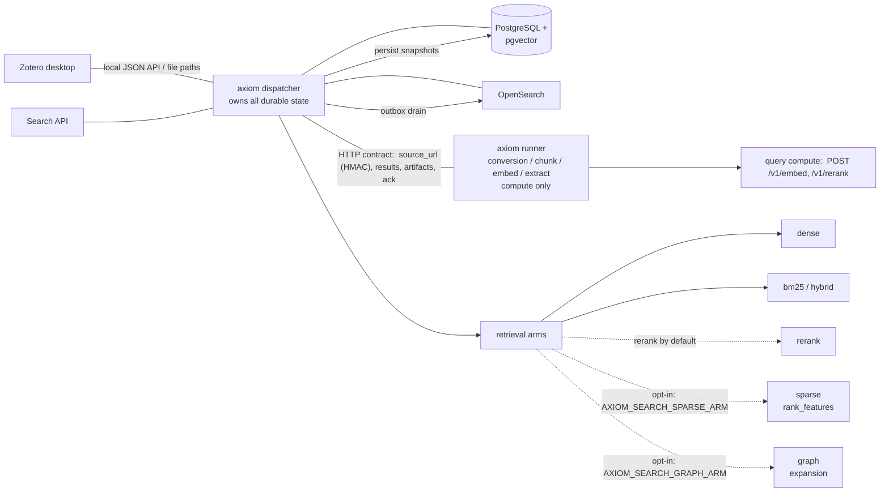
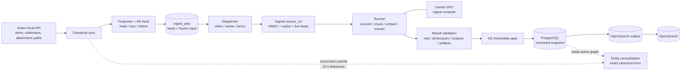
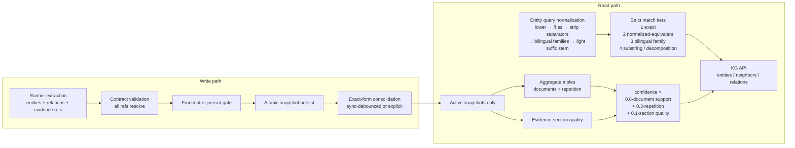
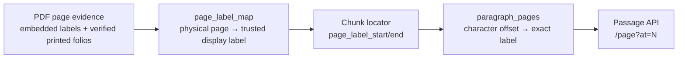

# Architecture Overview

> This is the entry chapter for developers. It gives the subsystem map, the
> transport rule, and the ownership boundary. Deeper chapters cover the two
> components ([axiom dispatcher](axiom-go.md), [axiom runner](axiom-runner.md)),
> [configuration](configuration.md), [testing](testing.md), and the
> [data model](../references/data-model.md).

axiom is a **Zotero-powered research knowledge system**: an RAG data pipeline
from the Zotero library, through document processing, to a searchable knowledge
base of chunks, entities, and relationships.

## System map



The central property: **axiom orchestrates, the runner computes, and only
axiom owns durable state.** Every box that writes to a store is axiom; the
runner never does.

## The three layers

1. **Dispatcher** — Zotero sync, ingest jobs, atomic lease
   claims with fencing, retries, cancellation, persistent IDs, versioned
   processing snapshots, durable derived artifacts, chunks/embeddings/entities/
   relationships, PostgreSQL/pgvector and graph write paths, OpenSearch outbox.
   It also serves the search API, driving query compute on the configured query
   runner.
   [Continue: axiom dispatcher](axiom-go.md)
2. **Runner (`axiom_ng_runner`)** — a loopback HTTP processor per
   `PROCESSOR_CONTRACT` v1, with vendored `compute_core` (Marker conversion,
   chunker, BGE-M3 embedder, GLiNER/mREBEL extractors). It owns only computation
   and temporary job output, never durable application state — and it also
   serves the query endpoints (`/v1/embed`, `/v1/rerank`) for search.
   [Continue: axiom runner](axiom-runner.md)
3. **Transport rule (contract v1)** — dispatcher and runner exchange only the
   HTTP contract. Sources travel via a signed `source_url`; results and
   artifacts are pulled; the ACK is pushed. Bulk flows need direct LAN
   reachability in both directions.
   [Details in the Deployment chapter](../operations/deployment.md)

## The transport boundary (decisive)

- **Source delivery:** when source delivery is configured, the dispatcher
  attaches an HMAC-signed, expiring `attachment.source_url` to every process
  request (contract §3, additive v1);
  the runner pulls the bytes over HTTP and runs the same hash gate as a local
  file. No shared Zotero mount is ever required.
- **Results and artifacts:** the dispatcher pulls the result and each artifact
  body. These are multi-MB bulk flows — direct LAN throughput in both
  directions is the operating rule (see Deployment).
- **ACK push:** only after axiom has durably committed the snapshot does it
  POST the acknowledgement, authorizing the runner to delete its temporary
  output. ACK is idempotent.

**Ownership:** the runner is **pure compute** — it never touches Zotero,
Postgres, OpenSearch, or the graph. Only the contract crosses the wire; all
durable state and all external stores belong to axiom. When the ingest
dispatcher is enabled, it negotiates capabilities before claiming work and
fails if the runner is unreachable or contract-incompatible.

## Runner roles

axiom separates compute into two roles, both defaulting to a local always-on
runner (`localhost:8012`): a **query role** (embed/rerank for the search API)
and an **ingest role** (`POST /v1/process`) with a primary + fallback failover
chain. The full role model — the env vars, the failover chain, the ~11×
local-runner trade-off — lives in
[axiom runner → Roles](axiom-runner.md#roles).

At startup the dispatcher probes capabilities and logs the resolved role wiring
(which URL plays query vs. ingest) so a misconfigured deployment is visible. A
missing **required ingest** capability fails the negotiation fast; a missing
**query** capability only degrades search with a warning — by design, so a
partial runner outage never takes retrieval down hard.

## Ingest and graph lifecycle

A Zotero sync is both a mirror operation and the admission point for processing.
File facts are computed before the database apply transaction. The canonical
mirror, normalized projections, collection memberships, ingest jobs, and Zotero
cursor then commit atomically. An unchanged preferred-attachment hash does not
create another job.



The dispatcher selects an ingest runner through the configured primary/fallback
chain. A remote runner pulls source bytes from axiom's HMAC-signed route; no
shared Zotero mount is required. Processor output is untrusted until axiom has
validated source identity, references, embedding dimensions, locators, result
statistics, and artifact digests and lengths.

The persist-time frontmatter gate removes entity mentions from TOCs, author
lists, prefaces, bibliographies, indexes, and title/byline sections before graph
rows are inserted. An entity without surviving mentions and a relation without
surviving evidence are dropped. The text chunks remain available to retrieval.
Snapshot activation, job completion, and OpenSearch index/delete outbox records
share one fenced transaction.

Every successful sync schedules entity consolidation after the response. A
10-second debounce collapses a sync burst into one run. Consolidation merges
active entities only when `coalesce(canonical_form, text)` is exactly equal;
mentions and relation endpoints move to the deterministic survivor. The same
idempotent operation is available through `POST /api/kg/consolidate` and the
`-consolidate-entities` one-shot command.

## Knowledge-graph write and read paths



KG reads never mutate persisted extractor `strength`. Neighbors and relations
compute `confidence` from three bounded terms:

```text
confidence = 0.6 × (1 - 1/(1 + documents))
           + 0.3 × (1 - 1/repetition)
           + 0.1 × section_quality

repetition = evidence_chunk_count + matching_triple_row_count - 1
```

`corroborating_documents` is the distinct-document support of a canonical
`(source_form, type, target_form)` triple across active snapshots. The legacy
`documents` field carries the same value. Entity search ranks exact and
normalized matches before popular fragments; mention count breaks ties only
inside a match tier. The complete parameters and response envelopes are in the
[HTTP API reference](../references/api.md#knowledge-graph).

## Page-label truth chain

The citation-facing page is derived from stored source evidence, not from a
chunk's position in a search result.



The runner's page-trust pipeline chooses a label and trust level for each
physical page. The chunker carries those labels into the locator and records a
new boundary whenever the page changes inside a chunk. Consequently,
`GET /api/passage/{id}/page?at=N` can resolve a hit position to one exact page
rather than returning only the chunk's page envelope. Older generations without
`paragraph_pages` return the broader span and do not fabricate precision.

## Retrieval flow and the recall arms

`POST /api/search` composes up to five recall arms and returns ranked hits with
source locators:

- **dense** (semantic embeddings) and **bm25** (exact-term) form the **hybrid**
  baseline — the best measured balance of quality and latency.
- **rerank** (cross-encoder) re-orders the hybrid candidates; on by default.
- **sparse** (`rank_feature` clauses, the third recall arm) and
  **graph** (knowledge-graph expansion) are **opt-in** behind
  `AXIOM_SEARCH_SPARSE_ARM` and `AXIOM_SEARCH_GRAPH_ARM` — both default off
  after the quality benchmark measured no gain for their cost.

The [User Guide → Retrieval](../user-guide/retrieval.md) explains each arm in
plain terms; the [Retrieval quality benchmark](../references/benchmarks/retrieval-quality.md)
carries the numbers.

## Runtime invariants

- Only the current lease owner may mutate an active job.
- Every job mutation after the claim is fenced by the lease token.
- A stale worker can neither complete nor fail a reclaimed job.
- No DB transaction stays open during CPU/model execution (Go never holds a
  transaction while waiting on Python).
- A processor result is untrusted input until Go fully validates it.
- Result persistence is atomic; a failure preserves the previous active
  snapshot.
- A job becomes `completed` only after the result + artifacts are durably
  committed.
- Processor ACK happens only after the durable commit and is idempotent.
- Normal ingest reads original PDF/EPUB files in place. The separately enabled
  repair path creates a quarantined recovery copy before a Zotero mutation.

## Where to continue?

- Contract in detail: [Processor Contract](processor-contract.md)
- Dispatcher/leases/persistence: [axiom dispatcher](axiom-go.md)
- Runner + endpoints + roles: [axiom runner](axiom-runner.md)
- Full `AXIOM_*` table: [Configuration](configuration.md)
- Operations: [Operations → Deployment](../operations/deployment.md)
- Schema and invariants: [Data Model](../references/data-model.md)
- Client-facing routes and response contracts: [HTTP API](../references/api.md)

Continue: [axiom dispatcher](axiom-go.md) · [axiom runner](axiom-runner.md)
