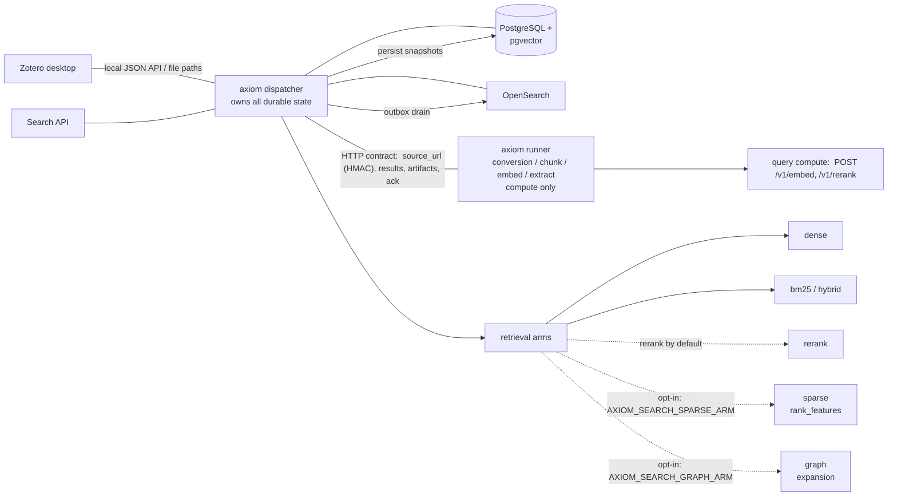

# Architecture Overview

> This is the entry chapter for developers. It gives the subsystem map, the
> transport rule, and the ownership boundary. Deeper chapters cover the two
> components ([axiom dispatcher](axiom-go.md), [axiom runner](axiom-runner.md)),
> [configuration](configuration.md), [testing](testing.md), and the
> [data model](../references/data-model.md).

axiom is a **Zotero-powered research knowledge system**: an RAG data pipeline
from the Zotero library, through document processing, to a searchable knowledge
base of chunks, entities, and relationships.

## System map

The central property: **axiom orchestrates, the runner computes, and only
axiom owns durable state.** Every box that writes to a store is axiom; the
runner never does.

## The three layers

1. **Dispatcher** — Zotero sync, ingest jobs, atomic lease
   claims with fencing, retries, cancellation, persistent IDs, versioned
   processing snapshots, durable derived artifacts, chunks/embeddings/entities/
   relationships, PostgreSQL/pgvector and graph write paths, OpenSearch outbox.
   It also serves the search API, driving query compute on a dedicated runner.
   [Continue: axiom dispatcher](axiom-go.md)
2. **Runner (`axiom_ng_runner`)** — a loopback HTTP processor per
   `PROCESSOR_CONTRACT` v1, with vendored `compute_core` (Marker conversion,
   chunker, BGE-M3 embedder, GLiNER/mREBEL extractors). It owns only computation
   and temporary job output, never durable application state — and it also
   serves the query endpoints (`/v1/embed`, `/v1/rerank`) for search.
   [Continue: axiom runner](axiom-runner.md)
3. **Transport rule (contract v1)** — dispatcher and runner exchange only the
   HTTP contract. Sources travel via a signed `source_url`; results and
   artifacts are pulled; the ACK is pushed. Bulk flows need direct LAN
   reachability in both directions.
   [Details in the Deployment chapter](../operations/deployment.md)

## The transport boundary (decisive)

- **Source delivery:** the dispatcher attaches an HMAC-signed, expiring
  `attachment.source_url` to every process request (contract §3, additive v1);
  the runner pulls the bytes over HTTP and runs the same hash gate as a local
  file. No shared Zotero mount is ever required.
- **Results and artifacts:** the dispatcher pulls the result and each artifact
  body. These are multi-MB bulk flows — direct LAN throughput in both
  directions is the operating rule (see Deployment).
- **ACK push:** only after axiom has durably committed the snapshot does it
  POST the acknowledgement, authorizing the runner to delete its temporary
  output. ACK is idempotent.

**Ownership:** the runner is **pure compute** — it never touches Zotero,
Postgres, OpenSearch, or the graph. Only the contract crosses the wire; all
durable state and all external stores belong to axiom. The dispatcher
negotiates capabilities at startup and fails if the runner is unreachable or
contract-incompatible.

## Runner roles

axiom separates compute into two roles, both defaulting to a local always-on
runner (`localhost:8012`): a **query role** (embed/rerank for the search API)
and an **ingest role** (`POST /v1/process`) with a primary + fallback failover
chain. The full role model — the env vars, the failover chain, the ~11×
local-runner trade-off — lives in
[axiom runner → Roles](axiom-runner.md#roles).

At startup the dispatcher probes capabilities and logs the resolved role wiring
(which URL plays query vs. ingest) so a misconfigured deployment is visible. A
missing **required ingest** capability fails the negotiation fast; a missing
**query** capability only degrades search with a warning — by design, so a
partial runner outage never takes retrieval down hard.

## Retrieval flow and the recall arms

`POST /api/search` composes up to five recall arms and returns ranked hits with
source locators:

- **dense** (semantic embeddings) and **bm25** (exact-term) form the **hybrid**
  baseline — the best measured balance of quality and latency.
- **rerank** (cross-encoder) re-orders the hybrid candidates; on by default.
- **sparse** (`rank_feature` clauses, the third recall arm, R5) and
  **graph** (knowledge-graph expansion, R6) are **opt-in** behind
  `AXIOM_SEARCH_SPARSE_ARM` and `AXIOM_SEARCH_GRAPH_ARM` — both default off
  after the quality benchmark measured no gain for their cost.

The [User Guide → Retrieval](../user-guide/retrieval.md) explains each arm in
plain terms; the [Retrieval quality benchmark](../references/benchmarks/retrieval-quality.md)
carries the numbers.

## Invariants (from the resolved work order)

- Only the current lease owner may mutate an active job.
- Every job mutation after the claim is fenced by the lease token.
- A stale worker can neither complete nor fail a reclaimed job.
- No DB transaction stays open during CPU/model execution (Go never holds a
  transaction while waiting on Python).
- A processor result is untrusted input until Go fully validates it.
- Result persistence is atomic; a failure preserves the previous active
  snapshot.
- A job becomes `completed` only after the result + artifacts are durably
  committed.
- Processor ACK happens only after the durable commit and is idempotent.
- Original PDF/EPUB are read in place and never durably copied.

## Where to continue?

- Contract in detail: [Processor Contract](processor-contract.md)
- Dispatcher/leases/persistence: [axiom dispatcher](axiom-go.md)
- Runner + endpoints + roles: [axiom runner](axiom-runner.md)
- Full `AXIOM_*` table: [Configuration](configuration.md)
- Operations: [Operations → Deployment](../operations/deployment.md)
- Schema and invariants: [Data Model](../references/data-model.md)

Continue: [axiom dispatcher](axiom-go.md) · [axiom runner](axiom-runner.md)
