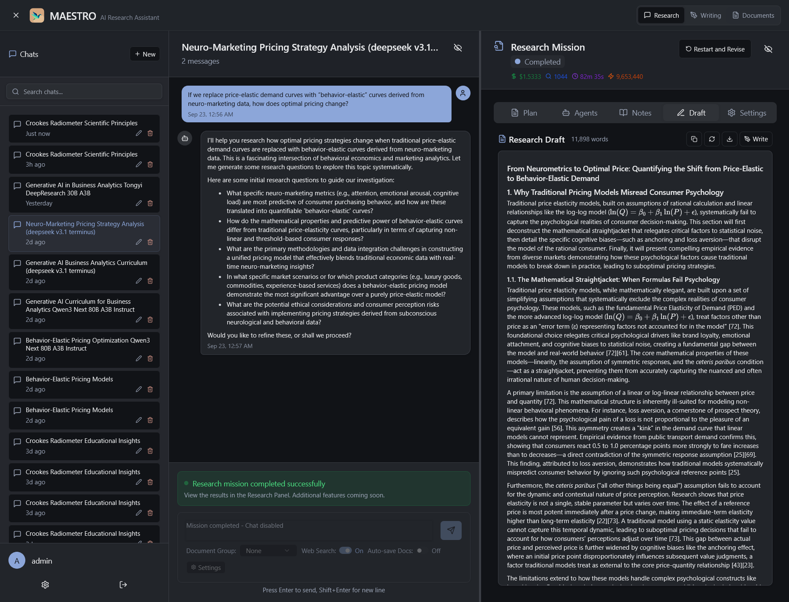
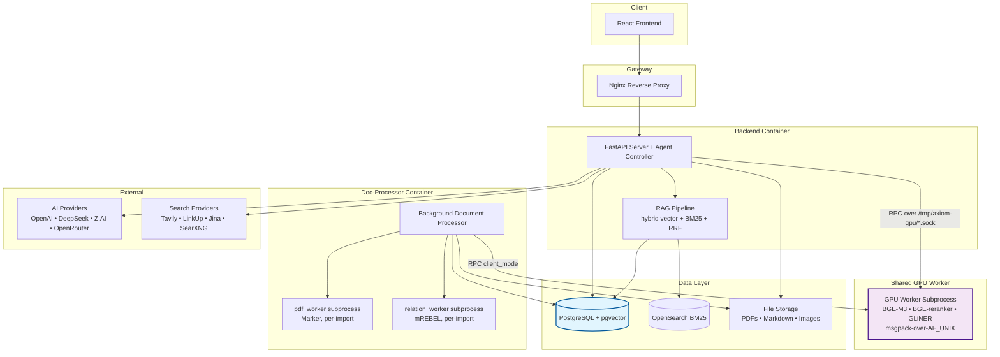

# AXIOM Documentation

  
  
  <h3 style="margin-top: 1rem;">Your Self-Hosted AI Research Assistant</h3>
  
  

    
    
    
  

---

## Welcome to AXIOM

What is AXIOM?

AXIOM is an <strong>AI-powered research platform</strong> you can host on your own hardware. It's designed to manage complex research tasks from start to finish in a collaborative research environment.

**Transform your research workflow:** Plan your research questions → Let AI agents investigate → Receive comprehensive reports with citations

  

### Why Choose AXIOM?

:material-brain: **Advanced AI Integration**  
Leverage multiple LLMs including GPT-5, DeepSeek, Z.AI (Zhipu GLM), Claude (via OpenRouter), and local models for diverse research capabilities

:material-magnify: **Deep Document Analysis**  
Advanced RAG pipeline with dual embeddings for superior search accuracy

:material-refresh: **Iterative Research Process**  
Multi-agent system that refines findings through reflection and critique loops

:material-lock-outline: **Complete Data Privacy**  
Self-hosted solution ensures your sensitive research never leaves your infrastructure

## Quick Links

-   **[Quick Start](getting-started/quickstart.md)**
    
    Get AXIOM up and running in minutes with Docker

-   **[Installation](getting-started/installation/index.md)**
    
    Detailed installation instructions for various platforms

-   **[User Guide](user-guide/index.md)**
    
    Learn how to use all of AXIOM's features

-   **[Example Reports](example-reports/index.md)**
    
    See real research outputs from various AI models

## Core Features

-   :material-file-document-multiple: **Document Management**
    
    ---
    
    Upload and manage your research documents in a central library
    
    - PDF, Word, and Markdown support
    - Advanced RAG pipeline with BGE-M3 embeddings
    - Semantic search across all documents
    - Document groups for organized research

-   :material-robot: **Intelligent Research**
    
    ---
    
    AI agents conduct thorough research based on your requirements
    
    - Multi-agent system with 5 specialized agents
    - Iterative research with reflection loops
    - Automatic source citation and tracking
    - Customizable research depth and focus

-   :material-typewriter: **Writing Assistant**
    
    ---
    
    AI-powered writing support for reports and documentation
    
    - Context-aware suggestions from your library
    - Real-time collaborative editor
    - LaTeX formula support
    - Reference management and citations

-   :material-web: **Web Integration**
    
    ---
    
    Seamlessly search and fetch content from the internet
    
    - Multiple search providers (Tavily, LinkUp, Jina)
    - Automatic content extraction and parsing
    - JavaScript-heavy site support
    - Smart query expansion

-   :material-account-group: **Multi-User Support**
    
    ---
    
    Built for collaborative research environments
    
    - Role-based access control
    - Personal document libraries
    - Shared research missions
    - Individual settings and preferences

-   :material-shield-lock: **Self-Hosted Privacy**
    
    ---
    
    Complete control over your data and infrastructure
    
    - Run on your own hardware
    - No data leaves your servers
    - Support for local LLMs
    - Full audit trail and logging

## System Requirements

### :material-check-circle: **Minimum Requirements**

- Docker & Docker Compose v2.0+
- 16GB RAM
- 30GB free disk space
- Internet connection
- API keys for at least one AI provider

### :material-rocket: **Recommended Setup**

- 32GB+ RAM for better performance
- 50GB+ SSD storage
- NVIDIA GPU for 3-5x faster processing
- Multiple AI provider keys
- Local LLM capability (RTX 3090/4090)

## Architecture Overview

AXIOM is built with a modern, scalable architecture:

## Documentation Sections

### Getting Started

- **[Quick Start](getting-started/quickstart.md)** - Get up and running in minutes
- **[Installation](getting-started/installation/index.md)** - Platform-specific installation guides
- **[Configuration](getting-started/configuration/overview.md)** - Configure AI providers and settings
- **[First Login](getting-started/first-login.md)** - Initial setup and user creation

### Using AXIOM

- **[User Guide](user-guide/index.md)** - Complete guide to all features
- **[Research](user-guide/research/overview.md)** - Creating and managing research missions
- **[Writing](user-guide/writing/overview.md)** - Using the AI writing assistant
- **[Documents](user-guide/documents/overview.md)** - Managing your document library
- **[Settings](user-guide/settings/overview.md)** - Customizing your experience

### Advanced Topics

- **[Architecture](architecture/index.md)** - System design and components
- **[Document Processing Pipeline](architecture/document-pipeline.md)** - Full ingestion pipeline from upload to indexed content
- **[VRAM Management](architecture/vram-management.md)** - GPU memory sharing between ML models
- **[Local LLM Deployment](deployment/local-llms.md)** - Running models on your hardware
- **[Example Reports](example-reports/index.md)** - Sample outputs from various models
- **[Troubleshooting](troubleshooting/index.md)** - Solutions to common issues

## Latest Updates

-   :material-rocket: **Post-Fork Enhancements** <small>Oct 2025 – April 2026</small>

    ---

    **Major additions since forking from Maestro (350+ commits)**

    - **GPU worker subprocess** (production April 2026): shared embedder/reranker/GLiNER over msgpack-over-Unix-socket RPC, idle auto-unload, clean CUDA context release. See [GPU Worker Architecture](architecture/gpu-worker.md).
    - **RAG pipeline overhaul**: hybrid vector+BM25 search with RRF fusion, graph-enhanced retrieval, BGE-reranker-v2-m3 cross-encoder reranking
    - **Knowledge graph**: GLiNER zero-shot NER + mREBEL relation extraction with VRAM management
    - **Per-model device config**: `DEVICE_EMBEDDER`, `DEVICE_RERANKER`, `DEVICE_GLINER`, `DEVICE_MREBEL`, `DEVICE_MARKER`, `DEVICE_VISION` for tight VRAM budgets
    - **PDF page numbers**: 3-tier fallback (PDF labels, header/footer parsing, physical+1) for accurate citations
    - **Metadata enrichment**: CrossRef, OpenLibrary, OpenAlex lookups with fallback pipeline
    - **Chat RAG prompt**: unified DOCUMENT LIBRARY + TEXT EXCERPTS architecture with source references
    - Native DeepSeek and Z.AI (Zhipu GLM) provider support with special handling
    - Configurable citation profiles: Numbered, KMU Akademie APA 7, APA 7 English, and custom
    - Apple Silicon MPS GPU support, device-agnostic hardware management
    - 3-level JSON fallback and context window truncation for provider robustness
    - Deployment: nerdctl + containerd on Proxmox LXC (production), pre-built images, macOS hybrid dev stack

-   :material-rocket: **Version 0.1.10-alpha** <small>Released Oct 12, 2025</small>

    ---

    **Azure OpenAI & Configuration Improvements**

    - Full Azure OpenAI support including GPT-5 models with automatic parameter handling
    - Manual model entry toggle for providers without `/models` endpoint support
    - Fixed 401 errors from external providers no longer logging users out
    - Mission settings now persist correctly across server restarts
    - Disabled autocomplete on API key fields to prevent browser autofill

-   :material-history: **Version 0.1.9-alpha** <small>Released Oct 3, 2025</small>

    ---

    **Stability & Security Update**

    - Mission stability with proper checkpoint handling
    - Security update replacing passlib with maintained libpass fork
    - Bug fixes for Round/Pass counter and activity log persistence
    - Password compatibility fixed for authentication

-   :material-history: **Version 0.1.8-alpha** <small>Released Sep 26, 2025</small>

    ---

    **Mission Resilience & Document Intelligence Update**

    - Intelligent mission resume with complete checkpoint preservation
    - arXiv paper fetcher for direct academic paper processing
    - Writing phase resume support for interrupted missions
    - Document reprocessing and re-embedding capabilities

-   :material-history: **Version 0.1.7-alpha** <small>Released Jan 25, 2025</small>
    
    ---
    
    **Intelligent Document Management & Enhanced Research**
    
    - Auto-create document groups from web sources during research
    - Seamless transition with report and document sources from research to writing workspace
    - Research report versioning with easy version switching
    - Clickable document sources in writing mode
    - Restart and revise missions with improved outline handling

-   :material-history: **Version 0.1.6-alpha** <small>Released Jan 23, 2025</small>
    
    ---
    
    **Model Support & Cost Tracking**
    
    - GPT-5 support with configurable thinking levels
    - Improved cost tracking system
    - DeepSeek compatibility improvements
    - Enhanced error handling and retry logic

-   :material-timer: **Version 0.1.5-alpha** <small>Released Sep 2, 2025</small>
    
    ---
    
    **Major Performance & Stability Update**
    
    - Complete async backend migration (2-3x faster)
    - Fixed mission resume and recovery capabilities
    - Complete documentation overhaul
    - Enhanced UI/UX with LaTeX support
    - 50+ bug fixes and stability improvements

## Join the Community

-   :material-github: **GitHub**
    
    [View Repository](https://github.com/murtaza-nasir/axiom){ .md-button }
    
    Source code, issues, and contributions

-   :material-forum: **Discussions**
    
    [Join Community](https://github.com/murtaza-nasir/axiom/discussions){ .md-button }
    
    Ask questions and share experiences

-   :material-bug: **Issues**
    
    [Report Issues](https://github.com/murtaza-nasir/axiom/issues){ .md-button }
    
    Report bugs and request features

## License

AXIOM is open source software licensed under the [GNU Affero General Public License v3.0](license.md), ensuring it remains free and open for everyone.

---

🚀 Ready to Transform Your Research?

  <a href="getting-started/installation/docker/" class="md-button md-button--primary" style="margin: 0.5rem;">
    🐳 Install with Docker
  </a>
  <a href="getting-started/quickstart/" class="md-button" style="margin: 0.5rem;">
    ⚡ Quick Start Guide
  </a>
  <a href="user-guide/" class="md-button" style="margin: 0.5rem;">
    📚 Read Documentation
  </a>

<strong>Join hundreds of researchers using AXIOM to accelerate their work</strong>

