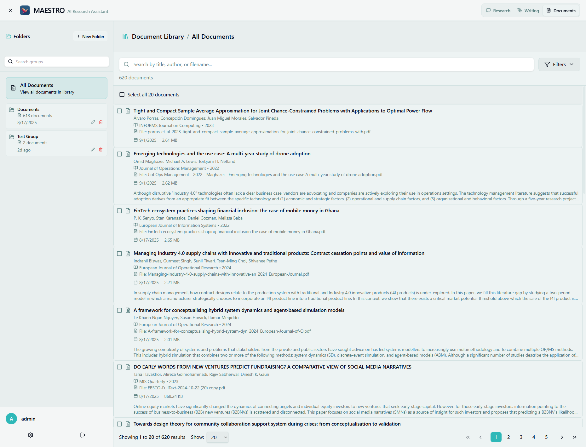

# Documents Overview

The document management system is the foundation of AXIOM's research capabilities, allowing you to upload, organize, and search through your document library.



## How Document Processing Works

When you upload a document, AXIOM:

1. **Validates** the file and checks for duplicates (SHA256)
2. **Stores** the original file and creates a database record
3. **Extracts metadata** using LLM (title, authors, year, DOI, ISBN)
4. **Enriches metadata** via CrossRef (DOI), OpenLibrary (ISBN), OpenAlex (title search)
5. **Converts** the document to markdown format using:
   - **PDF**: Marker with `paginate_output` (GPU-accelerated when available)
   - **Word**: python-docx for .docx/.doc files
   - **Markdown**: Direct processing
   - **EPUB**: pandoc conversion with figure extraction
6. **Extracts page labels** for PDFs (3-tier fallback: PDF labels, header/footer, physical+1)
7. **Chunks** content using token-based, structure-aware splitting with page tracking
8. **Generates** BGE-M3 embeddings (dense 1024-dim + sparse 30,000-dim)
9. **Indexes** in pgvector and OpenSearch (BM25 fulltext)
10. **Extracts entities** using GLiNER (zero-shot multilingual NER)
11. **Extracts relations** using mREBEL (multilingual triple extraction)
12. **Embeds images** using CLIP (if enabled)

For the full pipeline details, see [Document Processing Pipeline](../../architecture/document-pipeline.md).

## Supported File Formats

- **PDF** (.pdf) - Processed with Marker
- **Microsoft Word** (.docx, .doc) - Extracted with python-docx
- **Markdown** (.md, .markdown) - Direct processing
- **EPUB** (.epub) - Converted via pandoc
- **Plain Text** (.txt) - Simple text extraction

## Document Library Features

### Organization

- **Document Groups** - Create collections for projects
- **Metadata** - Automatic extraction of title, authors, abstract
- **Duplicate Detection** - SHA256 hash prevents duplicate uploads

### Search Capabilities

- **Hybrid Search** - Combines pgvector dense similarity with OpenSearch BM25 fulltext, merged via Reciprocal Rank Fusion (RRF)
- **Graph-Enhanced Retrieval** - Query-entity extraction (GLiNER) + entity relationship expansion for cross-document discovery
- **Cross-Encoder Reranking** - BGE-reranker-v2-m3 scores all candidates for precision
- **API Endpoint** - `/api/documents/search` for programmatic access

### RAG and Knowledge Graph

- **Document-Aware Chat** - LLM responses grounded in your uploaded documents with page-accurate citations
- **Knowledge Graph** - GLiNER entity extraction + mREBEL relation extraction across your library
- **Graph-Enhanced Retrieval** - Query entities and relationship traversal surface chunks vector search would miss
- **Image Search** - Multimodal CLIP-based search over extracted document images
- **Interactive Graph View** - Force-directed visualization of entities and connections

For full details, see [RAG and Knowledge Graph](rag-knowledge-graph.md).

## Processing Status

Documents go through these stages:

- **Uploading** - File being transferred
- **Processing** - Conversion and embedding generation
- **Completed** - Ready for use
- **Failed** - Error occurred (check `processing_error` field)

## Using the Document System

### Web Interface

1. Navigate to the Documents tab
2. Click "Upload Documents" or drag and drop files
3. Monitor processing status
4. Search documents using the search bar

### CLI Upload

Use the axiom-cli.sh script for bulk uploads:

```bash
# Upload documents for a user
./axiom-cli.sh ingest <username> <directory>

# Force re-embedding
./axiom-cli.sh ingest <username> <directory> --force-reembed

# Add to specific group
./axiom-cli.sh ingest <username> <directory> --group <group_id>
```

### Creating Document Groups

Groups help organize documents:

```bash
# Create a group via CLI
./axiom-cli.sh create-group <username> "Group Name"

# List groups
./axiom-cli.sh list-groups
```

## Search and Retrieval

### Search Interface

Enter natural language queries to find relevant documents. The system uses:
- **pgvector** -- BGE-M3 dense embeddings (1024 dimensions) with HNSW index
- **OpenSearch** -- BM25 fulltext search (when enabled)
- **RRF fusion** -- merges vector and BM25 results with configurable weights (default 0.7/0.3)
- **Graph retrieval** -- query-entity extraction + entity relationship expansion
- **Reranking** -- BGE-reranker-v2-m3 cross-encoder for final precision

### Search Examples

- Conceptual: "papers about machine learning optimization"
- Specific: "CRISPR gene editing techniques"
- Author-based: "research by Smith et al"

## Storage Architecture

Documents are stored in three locations:

1. **PostgreSQL Database** - Metadata and document chunks
2. **File System** - Original files and markdown conversions
   - Raw files: `/app/data/raw_files/{doc_id}_{filename}`
   - Markdown: `/app/data/markdown_files/{doc_id}.md`
3. **PostgreSQL with pgvector** - Embeddings for search

## Processing Performance

- **GPU Available**: Faster PDF processing with Marker
- **CPU Only**: Falls back to CPU (slower but functional)
- **Batch Processing**: Use CLI for efficient bulk uploads
- **Concurrent Uploads**: Multiple files processed in parallel

## Troubleshooting

### Processing Failures

Check the `processing_error` field in the database:
```bash
docker exec axiom-postgres psql -U axiom_user -d axiom_db \
  -c "SELECT id, title, processing_error FROM documents WHERE status = 'failed';"
```

### Re-processing Documents

```bash
# Force re-embedding via CLI
./axiom-cli.sh ingest <username> <directory> --force-reembed
```

### Storage Issues

Monitor disk usage:
```bash
# Check Docker volumes
docker system df

# Check specific paths
du -sh axiom_backend/data/*
```

## Best Practices

1. **File Preparation**
   - Ensure PDFs have extractable text (not scanned images)
   - Keep files under 50MB for optimal processing
   - Use descriptive filenames

2. **Organization**
   - Create groups for different projects
   - Use consistent naming conventions
   - Regular cleanup of unused documents

3. **Performance**
   - Use CLI for bulk uploads
   - Process large batches during off-hours
   - Monitor storage usage

## Next Steps

- [Uploading Documents](uploading.md) - Detailed upload guide
- [Document Groups](document-groups.md) - Organizing collections
- [RAG and Knowledge Graph](rag-knowledge-graph.md) - Document-aware chat, knowledge graph, and image search
- [Document Processing Pipeline](../../architecture/document-pipeline.md) - Full pipeline walkthrough
- [VRAM Management](../../architecture/vram-management.md) - GPU memory sharing between models
- [CLI Commands](../../getting-started/installation/cli-commands.md) - Bulk operations