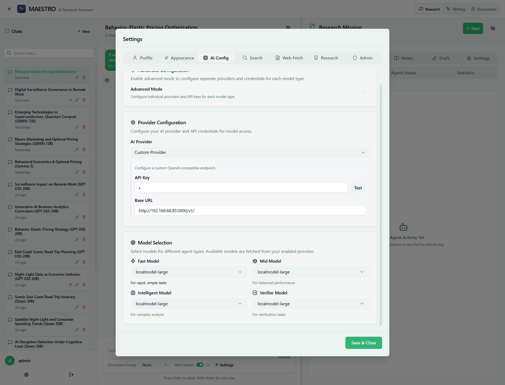

# AI Configuration

Configure language model providers to power AXIOM's research and writing capabilities.

For complete details on AI provider configuration, see the comprehensive [AI Provider Configuration Guide](../../getting-started/configuration/ai-providers.md).

## Quick Overview

AXIOM supports multiple AI providers through a unified interface:

- **OpenRouter** - Access to 100+ models via unified API
- **OpenAI** - Direct access to GPT models
- **DeepSeek** - Native support for deepseek-chat and deepseek-reasoner with automatic special handling (8192 max_tokens, no temperature for reasoner)
- **Z.AI (Zhipu GLM)** - Native support for GLM models (glm-5, glm-4.5, glm-4.5-air) with up to 205K context window
- **Custom Provider** - Any OpenAI-compatible endpoint (local LLMs, enterprise endpoints)

## Model Types Used by AXIOM

AXIOM automatically assigns different model types to various agents:

### Fast Model
Used by: Planning Agent, Note Assignment, Query Strategy, Router

- Quick decisions and simple formatting

### Mid Model (Default)
Used by: Research Agent, Writing Agent, Messenger Agent

- General research and writing tasks

### Intelligent Model
Used by: Reflection Agent, Query Preparation, Critical Analysis

- Complex reasoning and quality assessment

### Verifier Model
Used by: Fact-checking and validation tasks

- Ensuring accuracy of information

## Configuration Steps

1. **Navigate to Settings** → AI Config tab
2. **Enable Advanced Configuration** checkbox for per-model settings
3. **For each model type**:
      - Select "Custom Provider"
      - Enter API key (if required)
      - Enter base URL
      - Click "Test" to verify connection
      - Select model from dropdown
4. **Save & Close** to apply settings

## Common Endpoints

- **OpenRouter**: `https://openrouter.ai/api/v1/`
- **OpenAI**: `https://api.openai.com/v1/`
- **Local Ollama**: `http://host.docker.internal:11434/v1/` (or check your ollama config)
- **Local vLLM**: `http://host.docker.internal:8000/v1/` (or check your vllm config)

## Cost Tracking Note

**Important**: Tracked costs in AXIOM may differ from your API provider dashboard, especially with aggregator services like OpenRouter. This is because aggregators route to different backend providers with varying actual costs. For details, see [Cost Tracking Discrepancies](../../troubleshooting/common-issues/ai-models.md#cost-tracking-discrepancies).

## Related Documentation

- [Complete AI Provider Guide](../../getting-started/configuration/ai-providers.md) - Detailed setup instructions
- [Search Configuration](search-config.md) - Configure web search providers
- [Research Configuration](research-config.md) - Optimize research parameters
- [Cost Tracking Issues](../../troubleshooting/common-issues/ai-models.md#cost-tracking-discrepancies) - Understanding billing discrepancies